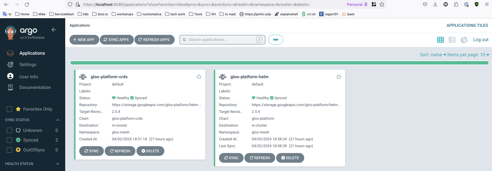
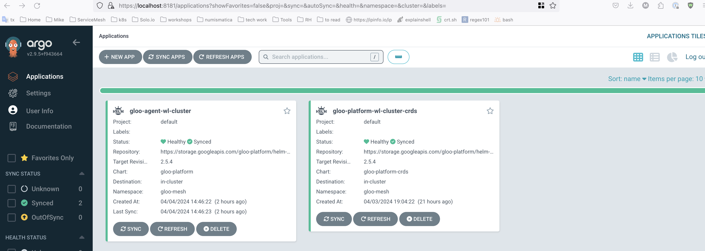
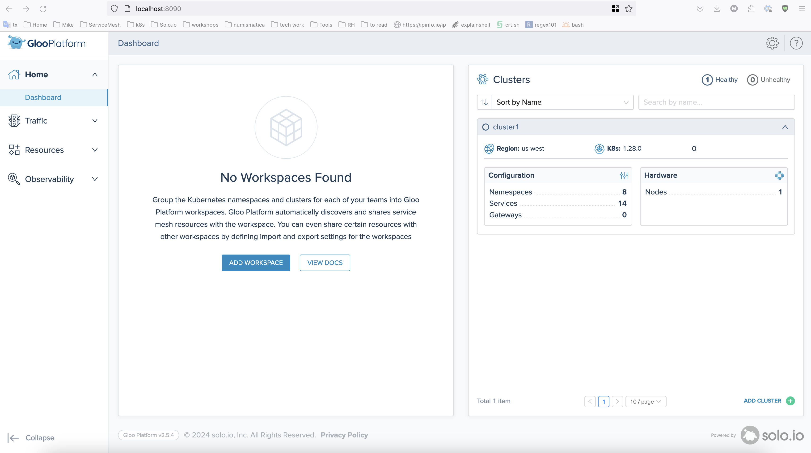
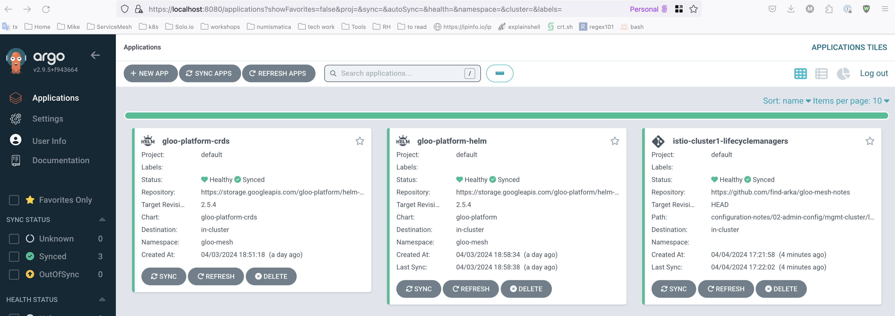
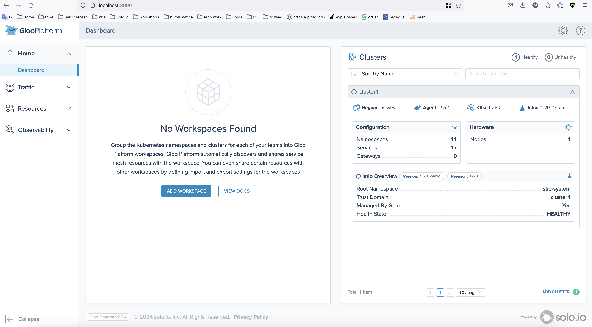

## General Guidance on the Basics of Gloo Configuration Management

Disclaimer: The goal for these notes is to reflect a possible scenario of how to Install Gloo Platform resources using ArgoCD. It is not an ArgoCD architectural guidance or a goal to define how ArgoCD should be deployed.

A good practice in configuration management is to split between persona concerns, in the example below, we are placing the configuration (gitops resources) related to operations on a folder named (`01-ops-config`)[/01-ops-config] which should contain resources related to provisioning Gloo Platform and the configuration values for the components.

On a second folder named (`02-admin-config`)[/02-admin-config] you should place concerns related to admin configuration like Workspaces, WorkspaceSettings, ILM, GLM and resources targeted for mesh administration.

Finally, on a third folder named (`03-app-config`)[/03-app-config] you should place configuration that's probably better suited to be managed by a developer persona for an application, like Virtual Gateways, Route Tables and Policies.

Below there is a step by step guide on how to install Gloo Platform resources based on the configuration management described above and using ArgoCD Application resources. The installations steps are the same as described before ('installation-notes/using-kubectl-and-helm')[/installation-notes/using-kubectl-and-helm] just using Helm charts. This example configuration was created using local Kind clusters and is not intended for production.

### Prerequisites

- 2x k8s clusters, one for MP (mgmt) and one for WL (cluster1)
- ArgoCD installed on each cluster

### `01-ops-config` Gloo Platform Installation Using ArgoCD

Starting on the folder (`01-ops-config`)[/01-ops-config] you can find two sub-folders, one targeting the management cluster and one targeting the workload cluster.
Take a look at the Gloo Platform CRDs ArgoCD App:
```yaml
apiVersion: argoproj.io/v1alpha1
kind: Application
metadata:
  name: gloo-platform-crds
  namespace: argocd
...
spec:
  destination:
    namespace: gloo-mesh
    server: https://kubernetes.default.svc
  project: default
  source:
    chart: gloo-platform-crds
    repoURL: https://storage.googleapis.com/gloo-platform/helm-charts
    targetRevision: 2.5.4
...
```

As observed on the resource this ArgoCD App's only purpose is to point to the `gloo-platform-crds` chart as a source.

On the `mgmt` cluster install the Gloo Platform CRDs using the ArgoCD App:
```bash
kubectl apply -f mgmt-cluster/gloo-platform-crds-argo-app.yaml
```

Now inspect the Gloo Platform chart and values ArgoCD App:
```yaml
apiVersion: argoproj.io/v1alpha1
kind: Application
metadata:
...
  name: gloo-platform-helm
  namespace: argocd
spec:
...
  source:
    chart: gloo-platform
    helm:
      skipCrds: true
      values: |
        licensing:
          glooMeshLicenseKey: "REDACTED"
        common:
          cluster: mgmt
        glooMgmtServer:
          enabled: true
          agents:
            - name: cluster1
          serviceType: LoadBalancer
        prometheus:
          enabled: true
        redis:
          deployment:
            enabled: true
        glooUi:
          enabled: true
        telemetryGateway:
          enabled: true
          service:
            type: LoadBalancer
        telemetryCollector:
          enabled: true
    repoURL: https://storage.googleapis.com/gloo-platform/helm-charts
    targetRevision: 2.5.4
...
```

On the `mgmt` cluster install the Gloo Platform:
```bash
kubectl apply -f mgmt-cluster/gloo-platform-helm-argo-app.yaml
```

Check the ArgoCD Apps status:
```bash
kubectl get applications.argoproj.io -n argocd -o wide
NAME                 SYNC STATUS   HEALTH STATUS   REVISION
gloo-platform-crds   Synced        Healthy         2.5.4
gloo-platform-helm   Synced        Healthy         2.5.4
```

Or check the Argo UI on the `mgmt` cluster:


Verify the needed ns and pods are up and running without issues:
```bash
kubectl get pods -A
NAMESPACE            NAME                                                READY   STATUS    RESTARTS   AGE
argocd               argocd-application-controller-0                     1/1     Running   0          2d1h
argocd               argocd-applicationset-controller-648f879985-brv2g   1/1     Running   0          2d1h
argocd               argocd-dex-server-c47667b69-7d2mg                   1/1     Running   0          2d1h
argocd               argocd-notifications-controller-6d4fbb84cd-88zfg    1/1     Running   0          2d1h
argocd               argocd-redis-6976fc7dfc-jpftk                       1/1     Running   0          2d1h
argocd               argocd-repo-server-6b86c8c4d5-8wd8s                 1/1     Running   0          2d1h
argocd               argocd-server-6b5c899867-db4lk                      1/1     Running   0          2d1h
gloo-mesh            gloo-mesh-mgmt-server-855946fc8d-2cxk7              1/1     Running   0          21h
gloo-mesh            gloo-mesh-redis-5c9fb9654b-85wh4                    1/1     Running   0          21h
gloo-mesh            gloo-mesh-ui-67dc689c5c-895h8                       3/3     Running   0          21h
gloo-mesh            gloo-telemetry-collector-agent-k6zx9                1/1     Running   0          21h
gloo-mesh            gloo-telemetry-gateway-6cc5cb7468-d86tp             1/1     Running   0          21h
gloo-mesh            prometheus-server-6cb68bf8d6-cdvd4                  2/2     Running   0          21h
kube-system          coredns-5dd5756b68-7kvz2                            1/1     Running   0          2d6h
kube-system          coredns-5dd5756b68-wrwzq                            1/1     Running   0          2d6h
kube-system          etcd-kind1-control-plane                            1/1     Running   0          2d6h
kube-system          kindnet-kxkm8                                       1/1     Running   0          2d6h
kube-system          kube-apiserver-kind1-control-plane                  1/1     Running   0          2d6h
kube-system          kube-controller-manager-kind1-control-plane         1/1     Running   0          2d6h
kube-system          kube-proxy-cg96z                                    1/1     Running   0          2d6h
kube-system          kube-scheduler-kind1-control-plane                  1/1     Running   0          2d6h
local-path-storage   local-path-provisioner-6f8956fb48-hlbf7             1/1     Running   0          2d6h
metallb-system       controller-786f9df989-p9k5l                         1/1     Running   0          2d6h
metallb-system       speaker-vhk8g                                       1/1     Running   0          2d6h
```

Now before moving to the workload cluster, lets get the RootCA and Identity token used as relay by the agent to connect to the management cluster:
> The relay-identity-token-secret value in the yaml must be replaced by fetching the value from the mgmt cluster.
```bash
TOKEN=$(kubectl get secret relay-identity-token-secret --context "${MGMT_CONTEXT}" -n gloo-mesh -o jsonpath='{.data.token}')
echo $TOKEN
```

> The ca.crt value in relay-root-tls-secret must be replaced by actual ca.crt value
```bash
CA_CRT=$(kubectl get secret relay-root-tls-secret --context "${MGMT_CONTEXT}" -n gloo-mesh -o jsonpath='{.data.ca\.crt}')
echo $CA_CRT
```

Having these values updated in the resources mentioned (`worload-cluster` folder), create the ns and secrets in the workload `cluster1`, after they should look like:
```bash
kubectl get secrets -n gloo-mesh
NAME                          TYPE     DATA   AGE
relay-identity-token-secret   Opaque   1      21h
relay-root-tls-secret         Opaque   1      21h
```

Now we have to install the same CRDs but on the workload cluster:
```bash
kubectl apply -f workload-cluster/gloo-platform-crds-argo-app.yaml
```

Check that everything went as expected:
```bash
kubectl get applications.argoproj.io -n argocd -o wide
NAME                            SYNC STATUS   HEALTH STATUS   REVISION
gloo-agent-wl-cluster           Synced        Healthy         2.5.4
gloo-platform-wl-cluster-crds   Synced        Healthy         2.5.4
```



Now check the Gloo Platform UI and make sure `cluster1` is registered:


### `02-admin-config` Gloo Platform Administration Configuration using ArgoCD

To get started in the (`02-admin-config`)[/02-admin-config] folder, create the `istio-gateways` ns and ingress gateway k8s service on the workload cluster `cluster1`:
```bash
kubectl apply -f workload-cluster/istio-gateway-ns.yaml
namespace/istio-gateways created
```

```bash
kubectl apply -f workload-cluster/istio-igw-svc.yaml
service/istio-ingressgateway created
```

Check your gtw got an external IP:
```bash
kubectl get svc -n istio-gateways
NAME                   TYPE           CLUSTER-IP     EXTERNAL-IP    PORT(S)                      AGE
istio-ingressgateway   LoadBalancer   10.2.162.143   172.18.102.2   80:32597/TCP,443:30923/TCP   41s
```

Inspect the ArgoCD App (`mgmt-cluster/cluster1-lm-argo-app.yaml`) for the `cluster1` lifecycle managers:
```yaml
apiVersion: argoproj.io/v1alpha1
kind: Application
metadata:
  name: istio-cluster1-lifecyclemanagers
  namespace: argocd
  finalizers:
  - resources-finalizer.argocd.argoproj.io
spec:
  project: default
  source:
    repoURL: https://github.com/find-arka/gloo-mesh-notes
    path: configuration-notes/02-admin-config/mgmt-cluster/lifecycle-managers
    targetRevision: HEAD
    directory:
      recurse: true
  destination:
    server: https://kubernetes.default.svc
...
```

As observed above, this app is only using as a source this repo and its pointing to the `lifecycle-managers` folder that contain the same YAML descriptors for the ILM/GLM CRDs you would use manually to install.

Be advised the workspace and workspace-settings folder have the same YAML descriptors used (here)[https://github.com/find-arka/gloo-mesh-notes/blob/main/workspaces-notes/sample-starter-workspaces/step-1-create-simple-workspaces.md] but there is no ArgoCD app resource provided. These are provided here just as an example. You could create a resource just for this, or create a more generic folder that includes the ILM/GLM and the workspace and workspace-settings etc.

Apply the app on the `mgmt` cluster:
```bash
kubectl apply -f mgmt-cluster/cluster1-lm-argo-app.yaml
application.argoproj.io/istio-cluster1-lifecyclemanagers created
```

You can observe on the `mgmt` Argo's UI the app being created:


Now check the Gloo UI for the Istio status on `cluster1`


Notice now how you can see the Istio Overview including the Istio version. Check for the pods on WL `cluster1`:
```bash
kubectl get pods -A | grep -e gloo-mesh -e istio-system -e istio-gateways
gloo-mesh            gloo-mesh-agent-5d7ccf9857-j5btj                    1/1     Running   0          167m
gloo-mesh            gloo-telemetry-collector-agent-cxxk6                1/1     Running   0          167m
istio-gateways       istio-ingressgateway-1-20-7b7b77dfbb-zpgw7          1/1     Running   0          12m
istio-system         istiod-1-20-65447bdbf-m85db                         1/1     Running   0          12m
```

You should have an ingress GW instance on the `istio-gateways` ns, the agent and telemetry collector agent on the `gloo-mesh` ns and the istiod instance in the `istio-system` ns.

### `03-app-config` Application Configuration using ArgoCD

Finally as can be seen on the folder, you should place in the (`03-app-config`)[/03-app-config] folder resources like `VirtualGateway`s `RouteTable`s and developer persona related type of Gloo policies like a `RetryTimeoutPolicy`.

In this folder you have the same sub-division used on the previous sections, one for the WL cluster and one for the MP. In this case the WL should contain nothing more than your app configuration and/or provisioning.

Create the Argo apps just for guidance:

MP `mgmt`
```bash
kubectl apply -f mgmt-cluster/my-app-config-argo-app.yaml
```

WL `cluster1`
```bash
kubectl apply -f workload-cluster/my-sample-argo-app.yaml
```
