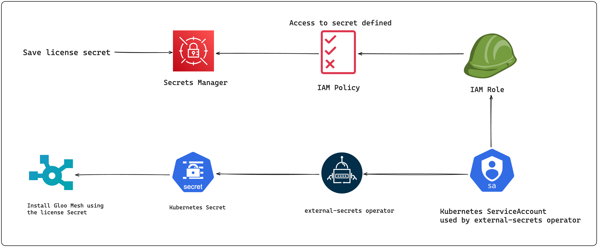

# Retrieving Gloo Mesh License Secret from AWS Secrets Manager

While working with enterprises we often come accross a common requirement that any form of secret information must not reside in a version control repository (e.g in github, gitlab repos etc). The Gloo Mesh license key is a secret that is required for installing and using the Gloo Mesh Enterprise product suite. In the gloo-platform helm chart, we have the following options when it comes to license key management:

- Pass the license key string/s through a helm value override.
- Create a Kubernetes `Secret` containing the license key string/s, and then refer the Kubernetes `Secret` name as a helm override value.

Mostly, enterprises prefer the second option due to internal compliance reasons. This document covers the use case where the license key secret is stored in the AWS Secrets Manager, and used for installing the Gloo Mesh Enterprise product suite. We use [IAM roles for service accounts](https://docs.aws.amazon.com/eks/latest/userguide/iam-roles-for-service-accounts.html) to setup the authorization of the secret stored in AWS Secrets manager.

Here are the steps that we will follow-

1. Create environment variables
2. Store the secret in the AWS Secrets Manager
3. Create EKS cluster with IAM OIDC provider enabled
4. Install [External Secrets Operator](https://github.com/external-secrets/external-secrets)
5. Create IAM Role and link with Kubernetes Service Account of the External Secrets Operator
6. Create Kubernetes Secret using the External Secrets custom resources
7. Install Gloo Mesh Enterprise referring the Kubernetes Secret
8. Validate Gloo Mesh installation



## Create environment variables

```bash
export GLOO_MESH_LICENSE_KEY="REDACTED_PLEASE_REPLACE"
export GLOO_GATEWAY_LICENSE_KEY="REDACTED_PLEASE_REPLACE"
export ACCOUNT_ID=$(aws sts get-caller-identity --query Account --output text)
export AWS_REGION=us-east-1
export EKS_CLUSTER=test-gme-eks-cluster
export SECRET_NAME=gloo-mesh-enterprise-license-keys
export EXTERNAL_SECRET_ACCESS_POLICY=external-secret-access-policy
export ESO_SERVICE_ACCOUNT=external-secret-operator-service-account
```

## Store secret in AWS Secret Manager

Create file containing license secrets. This file can be deleted once the secret gets created.

```bash
cat <<EOF > gloo-mesh-enterprise-license.json
{
  "gloo-mesh-license-key": "${GLOO_MESH_LICENSE_KEY}",
  "gloo-gateway-license-key": "${GLOO_GATEWAY_LICENSE_KEY}"
}
EOF
```

Create Secret in the AWS Secret Manager [using the aws CLI](https://docs.aws.amazon.com/cli/latest/reference/secretsmanager/create-secret.html)

```bash
aws secretsmanager create-secret \
    --name "${SECRET_NAME}" \
    --description "License keys secret for the Gloo Mesh Enterprise product suite" \
    --secret-string file://gloo-mesh-enterprise-license.json \
    --region "${AWS_REGION}" \
    --tags Key=created-by,Value=arka_bhattacharya Key=team,Value=customer-success
```

Delete the license key file once the AWS Secret gets created

```bash
rm gloo-mesh-enterprise-license.json
```

## Create EKS cluster with IAM OIDC provider enabled

```bash
eksctl create cluster --name "${EKS_CLUSTER}" \
  --spot --version=1.29 \
  --region "${AWS_REGION}" --nodes 2 --nodes-min 0 --nodes-max 3 \
  --instance-types t3.large \
  --with-oidc \
  --tags created-by=arka_bhattacharya,team=customer-success
```

If you have an existing EKS Cluster, you may follow the AWS docs to [create an IAM OIDC provider for your cluster](https://docs.aws.amazon.com/eks/latest/userguide/enable-iam-roles-for-service-accounts.html)

## Install External Secrets Operator

```bash
helm repo add external-secrets https://charts.external-secrets.io
helm repo update
helm upgrade -i external-secrets external-secrets/external-secrets \
  --namespace external-secrets \
  --create-namespace \
  --set serviceAccount.name="${ESO_SERVICE_ACCOUNT}" \
  --wait
```

## Create IAM Role and link with Kubernetes Service Account of the External Secrets Operator

Create IAM Policy JSON

```bash
cat <<EOF > eso_policy.json
{
  "Version": "2012-10-17",
  "Statement": [
    {
      "Effect": "Allow",
      "Action": [
        "secretsmanager:GetSecretValue",
        "secretsmanager:DescribeSecret",
        "secretsmanager:ListSecretVersionIds",
        "secretsmanager:GetResourcePolicy"
      ],
      "Resource": "*"
    }
  ]
}
EOF
```

Create the IAM Policy using the AWS CLI

```bash
aws iam create-policy \
  --policy-name "${EXTERNAL_SECRET_ACCESS_POLICY}" \
  --policy-document file://eso_policy.json
```

Delete the json after policy creation

```bash
rm eso_policy.json
```

Create an IAM ServiceAccount - `AWS IAM role` bound to a Kubernetes `ServiceAccount`

```bash
eksctl create iamserviceaccount \
  --name "${ESO_SERVICE_ACCOUNT}" \
  --namespace external-secrets \
  --cluster "${EKS_CLUSTER}" \
  --attach-policy-arn "arn:aws:iam::${ACCOUNT_ID}:policy/${EXTERNAL_SECRET_ACCESS_POLICY}" \
  --approve \
  --override-existing-serviceaccounts
```

- This creates the IAM Role, attaches the IAM Policy so that the secrets can be accessed.
- It updates the existing ServiceAccount object `external-secret-operator-service-account` and adds the following annotation to the same

```yaml
eks.amazonaws.com/role-arn: arn:aws:iam::${ACCOUNT_ID}:role/${IAM_ROLE}
```

## Create Kubernetes Secret using the External Secrets custom resources

Create gloo-mesh Namespace since the License `Secret` needs to be created here

```bash
kubectl create namespace gloo-mesh
```

Create the ClusterSecretStore. It represents a secure external location for storing secrets. We need to create a ClusterSecretStore instead of a SecretStore, since SecretStore is namespaced scoped, the Kubernetes ServiceAccount for the externel secrets operator lives in the external-secrets Namespace, but the Kubernetes Secret that we have to create needs to reside in the `gloo-mesh` Namespace.

```bash
kubectl apply -f- <<EOF
apiVersion: external-secrets.io/v1beta1
kind: ClusterSecretStore
metadata:
  name: aws-secret-store
  namespace: gloo-mesh
spec:
  provider:
    aws:
      service: SecretsManager
      region: "${AWS_REGION}"
      auth:
        jwt:
          serviceAccountRef:
            name: "${ESO_SERVICE_ACCOUNT}"
            namespace: external-secrets
EOF
```

Check Status of the ClusterSecretStore.

```bash
kubectl -n gloo-mesh get clustersecretstore aws-secret-store
```

Expected output

```bash
NAME               AGE   STATUS   CAPABILITIES   READY
aws-secret-store   37s   Valid    ReadWrite      True
```

Create the Kubernetes secret using the `ExternalSecret`

```bash
kubectl apply -f- <<EOF
apiVersion: external-secrets.io/v1beta1
kind: ExternalSecret
metadata:
  name: license-keys-external-secret
  namespace: gloo-mesh
spec:
# --- The amount of time before the values are read again from the SecretStore provider ---
  refreshInterval: 24h
# --- ClusterSecretStore referred ---
  secretStoreRef:
    name: aws-secret-store
    kind: ClusterSecretStore
# --- ClusterSecretStore referred ---
  target:
# --- Name of the Kubernetes Secret to be created ---
    name: "${SECRET_NAME}"
    creationPolicy: Owner
  data:
  - secretKey: gloo-mesh-license-key
    remoteRef:
# --- key contains the name of the secret stored in the AWS Secrets Manager ---
        key: "${SECRET_NAME}"
        property: gloo-mesh-license-key
  - secretKey: gloo-gateway-license-key
    remoteRef:
        key: "${SECRET_NAME}"
        property: gloo-gateway-license-key
EOF
```

Validate that the Kubernetes Secret has been created in the `gloo-mesh` Namespace.

```bash
kubectl -n gloo-mesh get secret "${SECRET_NAME}" -o=jsonpath='{.data.gloo-mesh-license-key}' | base64 -d
```

## Install Gloo Mesh Enterprise referring the Kubernetes Secret

Install the CRDs for the Gloo Mesh

```bash
helm upgrade -i gloo-platform-crds gloo-platform/gloo-platform-crds \
  --version="2.6.2" \
  --namespace=gloo-mesh --wait
```

Install the Gloo Mesh Enterprise components with the `licensing.licenseSecretName` value overridden with the Kubernetes Secret name:

```yaml
licensing:
  licenseSecretName: gloo-mesh-enterprise-license-keys
```

```bash
helm upgrade -i gloo-platform gloo-platform/gloo-platform \
  --version=2.6.2 \
  --namespace=gloo-mesh \
  --wait \
  --values - <<EOF
common:
  # Name of the cluster. Be sure to modify this value to match your cluster's name.
  cluster: "${EKS_CLUSTER}"
featureGates:
  istioLifecycleAgent: true
licensing:
  licenseSecretName: "${SECRET_NAME}"
# Configuration for the Gloo management server.
glooMgmtServer:
  enabled: true
  # create the KubernetesCluster custom resource
  agents:
    - name: "${EKS_CLUSTER}"
  serviceType: ClusterIP
glooAgent:
  enabled: true
  relay:
    serverAddress: gloo-mesh-mgmt-server:9900
# Configuration for the Gloo UI.
glooUi:
  enabled: true
# Gloo Platform Redis configuration options.
redis:
  deployment:
    enabled: true
prometheus:
  enabled: true
telemetryGateway:
  enabled: true
  service:
    type: ClusterIP
telemetryCollector:
  enabled: true
  config:
    exporters:
      otlp:
        endpoint: gloo-telemetry-gateway.gloo-mesh:4317
EOF
```

## Validate Gloo Mesh installation state

```bash
meshctl check
```

First couple of lines of the output shows that the licenses provided are valid

```bash
{"level":"info","ts":"2024-09-19T16:03:49.321-0400","caller":"client/client.go:283","msg":"VALID LICENSE: gloo-gateway Enterprise, issued at 2024-02-29 17:06:21 -0500 EST, expires at 2026-07-30 18:06:21 -0400 EDT"}
{"level":"info","ts":"2024-09-19T16:03:49.321-0400","caller":"client/client.go:283","msg":"VALID LICENSE: gloo-mesh Enterprise, issued at 2024-02-29 17:04:52 -0500 EST, expires at 2026-07-30 18:04:52 -0400 EDT"}

🟢 License status

 INFO  gloo-mesh enterprise license expiration is 30 Jul 26 18:04 EDT
 INFO  gloo-gateway enterprise license expiration is 30 Jul 26 18:06 EDT
 INFO  No GraphQL license module found for any product

🟢 CRD version check


🟢 Gloo deployment status

Namespace | Name                           | Ready | Status
gloo-mesh | gloo-mesh-agent                | 1/1   | Healthy
gloo-mesh | gloo-mesh-mgmt-server          | 1/1   | Healthy
gloo-mesh | gloo-mesh-redis                | 1/1   | Healthy
gloo-mesh | gloo-mesh-ui                   | 1/1   | Healthy
gloo-mesh | gloo-telemetry-gateway         | 1/1   | Healthy
gloo-mesh | prometheus-server              | 1/1   | Healthy
gloo-mesh | gloo-telemetry-collector-agent | 2/2   | Healthy

🟢 Mgmt server connectivity to workload agents

Cluster              | Registered | Connected Pod
test-gme-eks-cluster | true       | gloo-mesh/gloo-mesh-mgmt-server-64bbc6ddf9-6qmks

Connected Pod                                    | Clusters
gloo-mesh/gloo-mesh-mgmt-server-64bbc6ddf9-6qmks | 1
```
