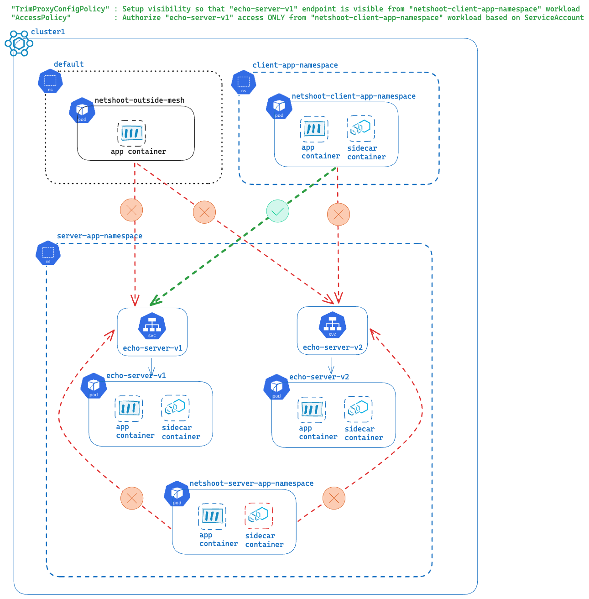

- [Zero trust setup notes](#zero-trust-setup-notes)
  - [Environment setup with k3d and docker](#environment-setup-with-k3d-and-docker)
  - [Setup mTLS and Zero trust](#setup-mtls-and-zero-trust)
    - [Test that all cases work at the moment](#test-that-all-cases-work-at-the-moment)
    - [Setup strict mTLS](#setup-strict-mtls)
    - [Setup default deny security posture](#setup-default-deny-security-posture)
    - [Test that all the access are denied](#test-that-all-the-access-are-denied)
  - [Setup Zero visibility for sidecars](#setup-zero-visibility-for-sidecars)
    - [list of endpoints visible before making the change](#list-of-endpoints-visible-before-making-the-change)
    - [Trim proxy visibility](#trim-proxy-visibility)
    - [Validate that sample app is not aware of other endpoints](#validate-that-sample-app-is-not-aware-of-other-endpoints)
  - [Selectively allow traffic from one in-mesh app to another in-mesh app](#selectively-allow-traffic-from-one-in-mesh-app-to-another-in-mesh-app)
    - [Set visibility](#set-visibility)
    - [Define explicit allow rule](#define-explicit-allow-rule)
    - [Test that only the allowed path is now working](#test-that-only-the-allowed-path-is-now-working)
  - [Setup domain based routing using the Istio ingress gateway](#setup-domain-based-routing-using-the-istio-ingress-gateway)
    - [Create gateways-workspace](#create-gateways-workspace)
    - [import from server-workspace](#import-from-server-workspace)
    - [export to gateways-workspace](#export-to-gateways-workspace)
    - [Add explicit allow rule for ingress to echo-server-v1 traffic](#add-explicit-allow-rule-for-ingress-to-echo-server-v1-traffic)
    - [Add explicit allow rule for ingress to echo-server-v2 traffic](#add-explicit-allow-rule-for-ingress-to-echo-server-v2-traffic)
    - [Routing config - create VirtualGateway](#routing-config---create-virtualgateway)
    - [Routing config - create RouteTable](#routing-config---create-routetable)
    - [Define traffic that is allowed through the Ingress Gateway](#define-traffic-that-is-allowed-through-the-ingress-gateway)
    - [Test using grpcurl](#test-using-grpcurl)
      - [port-forward the Ingress gateway](#port-forward-the-ingress-gateway)
      - [grpcurl through the localhost with explicit authority for hostname mapping](#grpcurl-through-the-localhost-with-explicit-authority-for-hostname-mapping)

# Zero trust setup notes

## Environment setup with k3d and docker

```bash
chmod +x setup-multicluster-gme-k3d-1-23.sh
./setup-multicluster-gme-k3d-1-23.sh
```

The script takes about 5 minutes and does the following:

- Create a docker network, creates 3 k3d clusters
- Installs Gloo Mesh mgmt server, Gloo Mesh agents
- Installs Istio ingress gateway in cluster 1 , egress gateway in cluster 2
- Installs some in-mesh apps (sidecar injected) and one outside mesh app (in default NS)


## Setup mTLS and Zero trust

### Test that all cases work at the moment

Expectation: #1, #2, #3 should all succeed

```bash
#1 Test access from app outside mesh (i.e. no sidecar) to app inside the mesh (has a sidecar)
kubectl --context k3d-workload-cluster1 -n default \
  exec -it deploy/netshoot-outside-mesh -c netshoot-outside-mesh \
  -- curl "http://echo-server-v1.server-app-namespace.svc.cluster.local:8080"
```

```bash
#2 Test access from app inside mesh but from different Namespace
kubectl --context k3d-workload-cluster1 -n client-app-namespace \
  exec -it deploy/netshoot-client-app-namespace -c netshoot-client-app-namespace \
  -- curl "http://echo-server-v1.server-app-namespace.svc.cluster.local:8080"
```

```bash
#3 Test access from app inside mesh and from the same Namespace
kubectl --context k3d-workload-cluster1 -n server-app-namespace \
  exec -it deploy/netshoot-server-app-namespace -c netshoot-server-app-namespace \
  -- curl "http://echo-server-v1.server-app-namespace.svc.cluster.local:8080"
```


### Setup strict mTLS

```bash
#PeerAuthentication:  To setup STRICT mTLS everywhere posture
for ((i = 1; i <= 2; i++))
do
  CURRENT_CONTEXT="k3d-workload-cluster${i}"
  kubectl apply --context ${CURRENT_CONTEXT} -f - <<EOF
apiVersion: security.istio.io/v1beta1
kind: PeerAuthentication
metadata:
  name: default-strict-mtls
  namespace: istio-system
spec:
  mtls:
    mode: STRICT
EOF
done
```

### Setup default deny security posture

```bash
#AuthorizationPolicy: To setup deny all traffic by default - zero trust security posture
for ((i = 1; i <= 2; i++))
do
  CURRENT_CONTEXT="k3d-workload-cluster${i}"
  kubectl apply --context ${CURRENT_CONTEXT} -f - <<EOF
apiVersion: security.istio.io/v1
kind: AuthorizationPolicy
metadata:
 name: allow-nothing
 namespace: istio-system
spec:
  {}
EOF
done
```

### Test that all the access are denied

Expectation: #1, #2, #3 should all fail due to default deny posture

```bash
#1 Test access from app outside mesh (i.e. no sidecar) to app inside the mesh (has a sidecar)
kubectl --context k3d-workload-cluster1 -n default \
  exec -it deploy/netshoot-outside-mesh -c netshoot-outside-mesh \
  -- curl "http://echo-server-v1.server-app-namespace.svc.cluster.local:8080"
```

```bash
#2 Test access from app inside mesh but from different Namespace
kubectl --context k3d-workload-cluster1 -n client-app-namespace \
  exec -it deploy/netshoot-client-app-namespace -c netshoot-client-app-namespace \
  -- curl "http://echo-server-v1.server-app-namespace.svc.cluster.local:8080"
```

```bash
#3 Test access from app inside mesh and from the same Namespace
kubectl --context k3d-workload-cluster1 -n server-app-namespace \
  exec -it deploy/netshoot-server-app-namespace -c netshoot-server-app-namespace \
  -- curl "http://echo-server-v1.server-app-namespace.svc.cluster.local:8080"
```


## Setup Zero visibility for sidecars

This potentially improves the CPU and Memory utilization of the istio-proxy sidecar container.

### list of endpoints visible before making the change

```bash
istioctl proxy-config endpoint \
  --context k3d-workload-cluster1 -n client-app-namespace \
  deploy/netshoot-client-app-namespace
```

### Trim proxy visibility

Trim proxy visibility using Gloo Mesh Workspaces. `trimAllProxyConfig: true` setting used.


```bash
#Trim proxy visibility
#WS, WSS
REMOTE_CONTEXT1="k3d-workload-cluster1"
REMOTE_CONTEXT2="k3d-workload-cluster2"
MGMT_CONTEXT=k3d-gloo-mgmt-cluster

# Create Config NS in mgmt cluster
kubectl --context ${MGMT_CONTEXT} create namespace "client-app-namespace-config"
kubectl --context ${MGMT_CONTEXT} create namespace "server-app-namespace-config"

# WS and Settings
kubectl apply --context ${MGMT_CONTEXT} -f- <<EOF
---
apiVersion: admin.gloo.solo.io/v2
kind: Workspace
metadata:
  name: client-app-workspace
  namespace: gloo-mesh
spec:
  workloadClusters:
  - name: ${MGMT_CONTEXT}
    namespaces:
    - name: "client-app-namespace-config"
# ---- "configEnabled: true" indicates we will save Gloo Mesh config in this namespace ----
    configEnabled: true
  - name: ${REMOTE_CONTEXT1}
    namespaces:
    - name: client-app-namespace
# ---- "configEnabled: false" The actual workloads run on this namespace, gloo mesh config doesn't live here ----
    configEnabled: false
  - name: ${REMOTE_CONTEXT2}
    namespaces:
    - name: client-app-namespace
    configEnabled: false
---
apiVersion: admin.gloo.solo.io/v2
kind: WorkspaceSettings
metadata:
  name: client-app-workspace
  namespace: "client-app-namespace-config"
spec:
# ---- importFrom "server-app-workspace" so that the Services can be accessed ----
  importFrom:
  - workspaces:
    - name: server-app-workspace
  options:
# ---- Set zero visibility for the sidecars ----
    trimAllProxyConfig: true
# ---- Setting serviceIsolation.enabled to false since we are uisng allow-nothing AuthorizationPolicy to setup default deny posture ----
    serviceIsolation:
      enabled: false
---
apiVersion: admin.gloo.solo.io/v2
kind: Workspace
metadata:
  name: server-app-workspace
  namespace: gloo-mesh
spec:
  workloadClusters:
  - name: ${MGMT_CONTEXT}
    namespaces:
    - name: server-app-namespace-config
    configEnabled: true
  - name: ${REMOTE_CONTEXT1}
    namespaces:
    - name: server-app-namespace
    configEnabled: false
  - name: ${REMOTE_CONTEXT2}
    namespaces:
    - name: server-app-namespace
    configEnabled: false
---
apiVersion: admin.gloo.solo.io/v2
kind: WorkspaceSettings
metadata:
  name: server-app-workspace
  namespace: server-app-namespace-config
spec:
# ---- exportTo "client-app-workspace" so that the Services can be accessed from "client-app-workspace" ----
  exportTo:
  - workspaces:
    - name: client-app-workspace
  options:
    trimAllProxyConfig: true
    serviceIsolation:
      enabled: false
EOF
```

### Validate that sample app is not aware of other endpoints

```bash
istioctl proxy-config endpoint \
  --context k3d-workload-cluster1 -n client-app-namespace \
  deploy/netshoot-client-app-namespace
```

Output should only show these:

```bash
ENDPOINT                                                STATUS      OUTLIER CHECK     CLUSTER
127.0.0.1:15000                                         HEALTHY     OK                prometheus_stats
127.0.0.1:15020                                         HEALTHY     OK                agent
unix://./etc/istio/proxy/XDS                            HEALTHY     OK                xds-grpc
unix://./var/run/secrets/workload-spiffe-uds/socket     HEALTHY     OK                sds-grpc
```

> At this point, we have configured:
>
> 1. **STRICT mTLS requirement**
> 2. **Default Deny posture**
> 3. **Minimal visibility for sidecar containers**

## Selectively allow traffic from one in-mesh app to another in-mesh app

### Set visibility

```bash
kubectl apply --context k3d-gloo-mgmt-cluster -f- <<EOF
apiVersion: resilience.policy.gloo.solo.io/v2
kind: TrimProxyConfigPolicy
metadata:
  name: trim-netshoots-visibility-cross-namespace
  namespace: client-app-namespace-config
spec:
  applyToWorkloads:
# ---- select the source workload on which this policy is applied  ----
  - selector:
      name: netshoot-client-app-namespace
      namespace: client-app-namespace
      workspace: client-app-workspace
  config:
    includedDestinations:
# ---- define the destination that should be visible from netshoot----
    - selector:
        name: echo-server-v1
        namespace: server-app-namespace
        workspace: server-app-workspace
EOF
```

> `istioctl proxy-config endpoint --context k3d-workload-cluster1 -n client-app-namespace deploy/netshoot-client-app-namespace` should now show the `echo-server-v1` endpoints

### Define explicit allow rule

```bash
kubectl apply --context k3d-gloo-mgmt-cluster -f- <<EOF
apiVersion: security.policy.gloo.solo.io/v2
kind: AccessPolicy
metadata:
  name: echo-server-v1-app-access
  namespace: server-app-namespace-config
spec:
  applyToWorkloads:
# ---- Define the destination workload which will be allowed to access ----
  - selector:
      labels:
        app: echo-server-v1
      namespace: server-app-namespace
      workspace: server-app-workspace
  config:
# ---- Important to set tlsMode: STRICT here as well ----
    authn:
      tlsMode: STRICT
    authz:
# ---- Define the source workload which can access the server ----
      allowedClients:
      - serviceAccountSelector:
          namespace: client-app-namespace
          name: netshoot-client-app-namespace
EOF
```

### Test that only the allowed path is now working



Expectation: Only #2 shall succeed and rest all shall fail

> Note: It takes a little bit of time for the config to be applied. So in case you don't get success on the first sample curl, try a couple more time and then the behavior becomes consistent once the policy changes are updated as envoy config.

```bash
#1 Test access from app outside mesh (i.e. no sidecar) to app inside the mesh (has a sidecar)
kubectl --context k3d-workload-cluster1 -n default \
  exec -it deploy/netshoot-outside-mesh -c netshoot-outside-mesh \
  -- curl "http://echo-server-v1.server-app-namespace.svc.cluster.local:8080"
```

```bash
#2 Test access from app inside mesh but from different Namespace
kubectl --context k3d-workload-cluster1 -n client-app-namespace \
  exec -it deploy/netshoot-client-app-namespace -c netshoot-client-app-namespace \
  -- curl "http://echo-server-v1.server-app-namespace.svc.cluster.local:8080"
```

```bash
#3 Test access from app inside mesh and from the same Namespace
kubectl --context k3d-workload-cluster1 -n server-app-namespace \
  exec -it deploy/netshoot-server-app-namespace -c netshoot-server-app-namespace \
  -- curl "http://echo-server-v1.server-app-namespace.svc.cluster.local:8080"
```

## Setup domain based routing using the Istio ingress gateway

### Create gateways-workspace


```bash
MGMT_CONTEXT=k3d-gloo-mgmt-cluster
REMOTE_CONTEXT1="k3d-workload-cluster1"
REMOTE_CONTEXT2="k3d-workload-cluster2"
# config NS creation
kubectl --context ${MGMT_CONTEXT} create namespace "gateways-config";
# Workspace creation
kubectl apply --context ${MGMT_CONTEXT} -f- <<EOF
apiVersion: admin.gloo.solo.io/v2
kind: Workspace
metadata:
  name: gateways-workspace
  namespace: gloo-mesh
spec:
  workloadClusters:
  - name: ${MGMT_CONTEXT}
    namespaces:
    - name: gateways-config
    configEnabled: true
  - name: ${REMOTE_CONTEXT1}
    namespaces:
    - name: 'istio-gateways'
    configEnabled: false
  - name: ${REMOTE_CONTEXT2}
    namespaces:
    - name: 'istio-gateways'
    configEnabled: false
EOF
```

### import from server-workspace

```bash
kubectl apply --context ${MGMT_CONTEXT} -f- <<EOF
---
apiVersion: admin.gloo.solo.io/v2
kind: WorkspaceSettings
metadata:
  name: gateways-workspace
  namespace: gateways-config
spec:
  importFrom:
  - workspaces:
    - name: "server-app-workspace"
  options:
# trimAllProxyConfig not set to true since Istio "Sidecar" custom resource is not applicable to gateways
# https://istio.io/latest/docs/reference/config/networking/sidecar/#:~:text=A%20Sidecar%20is%20not%20applicable%20to%20gateways
    serviceIsolation:
      enabled: false
EOF
```

### export to gateways-workspace

```bash
kubectl apply --context ${MGMT_CONTEXT} -f- <<EOF
apiVersion: admin.gloo.solo.io/v2
kind: WorkspaceSettings
metadata:
  name: server-app-workspace
  namespace: server-app-namespace-config
spec:
  exportTo:
  - workspaces:
    - name: client-app-workspace
# ---- exportTo gateways-workspace" so that the Services can be accessed from "client-app-workspace" ----
    - name: gateways-workspace
  options:
    trimAllProxyConfig: true
    serviceIsolation:
      enabled: false
EOF
```

### Add explicit allow rule for ingress to echo-server-v1 traffic

```bash
kubectl apply --context k3d-gloo-mgmt-cluster -f- <<EOF
apiVersion: security.policy.gloo.solo.io/v2
kind: AccessPolicy
metadata:
  name: echo-server-v1-app-access
  namespace: server-app-namespace-config
spec:
  applyToWorkloads:
  - selector:
      labels:
        app: echo-server-v1
      namespace: server-app-namespace
      workspace: server-app-workspace
  config:
    authn:
      tlsMode: STRICT
    authzList:
    - allowedClients:
      - serviceAccountSelector:
          namespace: client-app-namespace
          name: netshoot-client-app-namespace
# ---- So that Ingress can access the echo-server-v1 ----
    - allowedClients:
      - serviceAccountSelector:
          namespace: istio-gateways
          name: istio-ingressgateway-1-23-service-account
EOF
```

### Add explicit allow rule for ingress to echo-server-v2 traffic

```bash
kubectl apply --context k3d-gloo-mgmt-cluster -f- <<EOF
apiVersion: security.policy.gloo.solo.io/v2
kind: AccessPolicy
metadata:
  name: echo-server-v2-app-access
  namespace: server-app-namespace-config
spec:
  applyToWorkloads:
  - selector:
      labels:
        app: echo-server-v2
      namespace: server-app-namespace
      workspace: server-app-workspace
  config:
    authn:
      tlsMode: STRICT
    authzList:
# ---- So that Ingress can access the echo-server-v2 ----
    - allowedClients:
      - serviceAccountSelector:
          namespace: istio-gateways
          name: istio-ingressgateway-1-23-service-account
EOF
```

### Routing config - create VirtualGateway

```bash
kubectl --context k3d-gloo-mgmt-cluster apply -f - <<EOF
apiVersion: networking.gloo.solo.io/v2
kind: VirtualGateway
metadata:
  name: north-south-gw-common
  namespace: gateways-config
spec:
  workloads:
    - selector:
        labels:
          istio: ingressgateway
        cluster: k3d-workload-cluster1
  listeners: 
    - http: {}
      port:
        number: 8080
EOF
```

### Routing config - create RouteTable

Domain based routing: `echo-server-v1.consultsolo.net`

```bash
kubectl --context k3d-gloo-mgmt-cluster apply -f - <<EOF
apiVersion: networking.gloo.solo.io/v2
kind: RouteTable
metadata:
  name: ingress-to-echo-server-v1-grpc
  namespace: server-app-namespace-config
spec:
  hosts:
    - 'echo-server-v1.consultsolo.net'
  virtualGateways:
    - name: north-south-gw-common
      namespace: gateways-config
      cluster: k3d-gloo-mgmt-cluster
  workloadSelectors: []
  http:
    - name: ingress-to-echo-server-v1-route
      matchers:
      - uri:
          prefix: /
      forwardTo:
        destinations:
          - kind: SERVICE
            ref:
              name: echo-server-v1
              namespace: server-app-namespace
            port:
              # --- gRPC port for the application ---
              number: 9080
EOF
```

Domain based routing: `echo-server-v2.consultsolo.net`

```bash
kubectl --context k3d-gloo-mgmt-cluster apply -f - <<EOF
apiVersion: networking.gloo.solo.io/v2
kind: RouteTable
metadata:
  name: ingress-to-echo-server-v2-grpc
  namespace: server-app-namespace-config
spec:
  hosts:
    - 'echo-server-v2.consultsolo.net'
  virtualGateways:
    - name: north-south-gw-common
      namespace: gateways-config
      cluster: k3d-gloo-mgmt-cluster
  workloadSelectors: []
  http:
    - name: ingress-to-echo-server-v2-route
      matchers:
      - uri:
          prefix: /
      forwardTo:
        destinations:
          - kind: SERVICE
            ref:
              name: echo-server-v2
              namespace: server-app-namespace
            port:
              # --- gRPC port for the application ---
              number: 9080
EOF
```

### Define traffic that is allowed through the Ingress Gateway

```bash
kubectl --context k3d-workload-cluster1 apply -f - <<EOF
apiVersion: security.istio.io/v1
kind: AuthorizationPolicy
metadata:
  name: rule-for-ingress-traffic
  namespace: istio-gateways
spec:
  rules:
  - to:
    - operation:
        hosts:
        - '*.consultsolo.net'
EOF
```

### Test using grpcurl

#### port-forward the Ingress gateway

```bash
kubectl --context k3d-workload-cluster1 -n istio-gateways port-forward deploy/istio-ingressgateway-1-23 8080
```

#### grpcurl through the localhost with explicit authority for hostname mapping

```bash
grpcurl -authority echo-server-v1.consultsolo.net -plaintext localhost:8080 proto.EchoTestService/Echo | jq -r '.message'
```

```bash
grpcurl -authority echo-server-v2.consultsolo.net -plaintext localhost:8080 proto.EchoTestService/Echo | jq -r '.message'
```


