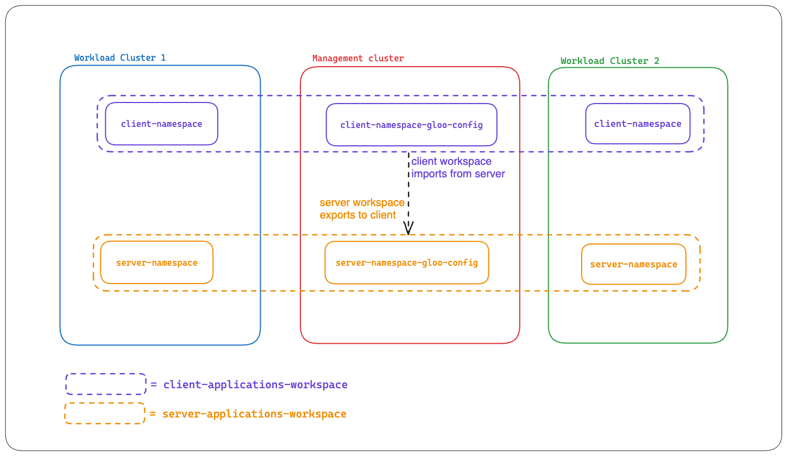

# Workspace configuration

### Create configuration namespaces in the management cluster

Gloo Mesh custom resources for the Workspace can be saved here.

```bash
kubectl --context "${MGMT_CONTEXT}" apply -f- <<EOF
apiVersion: v1
kind: Namespace
metadata:
  name: client-namespace-gloo-config
EOF
```

```bash
kubectl --context "${MGMT_CONTEXT}" apply -f- <<EOF
apiVersion: v1
kind: Namespace
metadata:
  name: server-namespace-gloo-config
EOF
```

### Creating Workspace objects



```bash
kubectl --context "${MGMT_CONTEXT}" apply -f- <<EOF
apiVersion: admin.gloo.solo.io/v2
kind: Workspace
metadata:
  name: client-applications-workspace
  namespace: gloo-mesh
spec:
  workloadClusters:
  - name: '*'                    # any cluster that has the namespace 'client-namespace'
    namespaces:
    - name: client-namespace
    configEnabled: false         # Dont read Gloo Mesh configuration from this namespace
  - name: "${MGMT_CONTEXT}"
    namespaces:
    - name: client-namespace-gloo-config
    configEnabled: true          # Gloo Mesh will read Gloo Mesh configuration from this namespace
EOF
```

```bash
kubectl --context "${MGMT_CONTEXT}" apply -f- <<EOF
apiVersion: admin.gloo.solo.io/v2
kind: Workspace
metadata:
  name: server-applications-workspace
  namespace: gloo-mesh
spec:
  workloadClusters:
  - name: '*'                    # any cluster that has the namespace 'server-namespace'
    namespaces:
    - name: server-namespace
    configEnabled: false         # Dont read Gloo Mesh configuration from this namespace
  - name: "${MGMT_CONTEXT}"
    namespaces:
    - name: server-namespace-gloo-config
    configEnabled: true          # Gloo Mesh will read Gloo Mesh configuration from this namespace
EOF
```

### Creating WorkspaceSettings objects

client applications (part of client-applications-workspace) needs to discover server applications (part of server-applications-workspace)

```bash
kubectl --context "${MGMT_CONTEXT}" apply -f- <<EOF
apiVersion: admin.gloo.solo.io/v2
kind: WorkspaceSettings
metadata:
  name: server-applications-workspacesettings
  namespace: server-namespace-gloo-config       # Configuration namespace
spec:
  exportTo:
  - workspaces:
    - name: client-applications-workspace       # Share service discovery with client-applications-workspace
  options:
    serviceIsolation:
      enabled: true                             # block traffic from outside the Workspace
      trimProxyConfig: true                     # enable scoping of service discovery to the workspace
EOF
```

```bash
kubectl --context "${MGMT_CONTEXT}" apply -f- <<EOF
apiVersion: admin.gloo.solo.io/v2
kind: WorkspaceSettings
metadata:
  name: client-applications-workspacesettings
  namespace: client-namespace-gloo-config       # Configuration namespace
spec:
  importFrom:
  - workspaces:
    - name: server-applications-workspace       # Import service discovery from server-applications-workspace
  options:
    serviceIsolation:
      enabled: true                             # block traffic from outside the Workspace
      trimProxyConfig: true                     # enable scoping of service discovery to the workspace
EOF
```

### Check Istio resources created by Gloo Mesh
```bash
get-istio-crs-in () {
    # get Istio custom resources in he namespace
    kubectl get istio-io -n "${1}" -o yaml > "istio-crs-${1}.yaml"
    # Split and create individual files
    cat "istio-crs-${1}.yaml" | yq '.items[] | split_doc' | yq 'del(.metadata.annotations["kubectl.kubernetes.io/last-applied-configuration"],.metadata.creationTimestamp,.metadata.generation,.metadata.managedFields,.metadata.resourceVersion,.metadata.selfLink,.metadata.uid,.status)' | yq -s '.kind + "_" + .metadata.name' --no-doc
    rm "istio-crs-${1}.yaml"
}
```

```bash
get-istio-crs-in client-namespace;
get-istio-crs-in server-namespace;
```

# Understanding more about import-export

server-applications-workspace exports it's resources to client-applications-workspace and client-applications-workspace imports the same, but client-applications-workspace is NOT exporting it's resources to any workspace. Thus, if we deploy an app in client-applications-workspace it should be accessible from only within the workspace, and not from outside.

### Deploy a sample service in `client-namespace` in one of the workload clusters

```bash
kubectl -n client-namespace \
    --context ${REMOTE_CONTEXT} \
    apply -f https://raw.githubusercontent.com/istio/istio/master/samples/httpbin/httpbin.yaml
```

### httpbin deployed in client-namespace will be inaccessible from server-namespace

1. Deploy a test app in server-namespace which has curl (e.g. netshoot)
2. Test accessing `httpbin.client-namespace:8000` from the server-namespace

Deploy netshoot
```bash
kubectl --context "${REMOTE_CONTEXT}" -n server-namespace apply -f- <<EOF
apiVersion: v1
kind: ServiceAccount
metadata:
  name: netshoot
---
apiVersion: apps/v1
kind: Deployment
metadata:
  name: netshoot
spec:
  replicas: 1
  selector:
    matchLabels:
      app: netshoot
  template:
    metadata:
      labels:
        app: netshoot
    spec:
      serviceAccountName: netshoot
      containers:
      - name: netshoot
        image: docker.io/nicolaka/netshoot:v0.12
        command: ["/bin/sh", "-c", "while true; do sleep 10; done"]
EOF
```

Test access
```bash
kubectl --context=${REMOTE_CONTEXT} -n server-namespace exec -it \
  deploy/netshoot \
  -c netshoot -- curl -v http://httpbin.client-namespace:8000/headers
```

Expected Output:
403 Forbidden with RBAC: access denied message
```bash
* IPv6: (none)
* IPv4: 172.20.107.240
*   Trying 172.20.107.240:8000...
* Connected to httpbin.client-namespace (172.20.107.240) port 8000
> GET /headers HTTP/1.1
> Host: httpbin.client-namespace:8000
> User-Agent: curl/8.6.0
> Accept: */*
>
< HTTP/1.1 403 Forbidden
< content-length: 19
< content-type: text/plain
< date: Thu, 21 Mar 2024 00:10:39 GMT
< server: istio-envoy
< x-envoy-decorator-operation: httpbin.client-namespace.svc.cluster.local:8000/*
<
* Connection #0 to host httpbin.client-namespace left intact
RBAC: access denied
```
